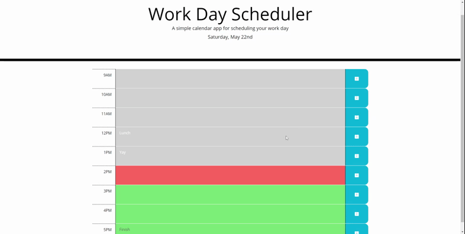

# Work Day Scheduler
## Version 1.0
### Built with HTML, CSS, JAVASCRIPT, JQUERY, BOOTSTRAP AND MOMENT
### [Link to "Quiz" page](https://jamwalab.github.io/quiz/)

### Project description
* Work day scheduler that displays:
    * Date on top.
    * Has option to fill out tasks from 9am to 5pm.
* Color coded - grey, red, green for past, present and future tasks, respectively.
* Tasks get saved when clicking the save button next to it.
* If clicked anywhere else besides the save button next to the task, any changes made will roll back.
* Current time is checked every 3 minutes to make sure color coding is correct.
* All tasks are saved in local storage for each date.

### Build process
* Current time is captured and displayed with moment.
* Task rows are created for each time with Bootstrap.
* Using click event on the text space, taskarea is created.
* Using the click event, if the corresponding save button is clicked, task gets saved.
* For everything else, blur event is used to capture click or activities, which in turn coverts the text area back and places the original data there.
* Activities inside the blur event are executed afte a delay of 300ms to avoid conflict with the save button click event. 